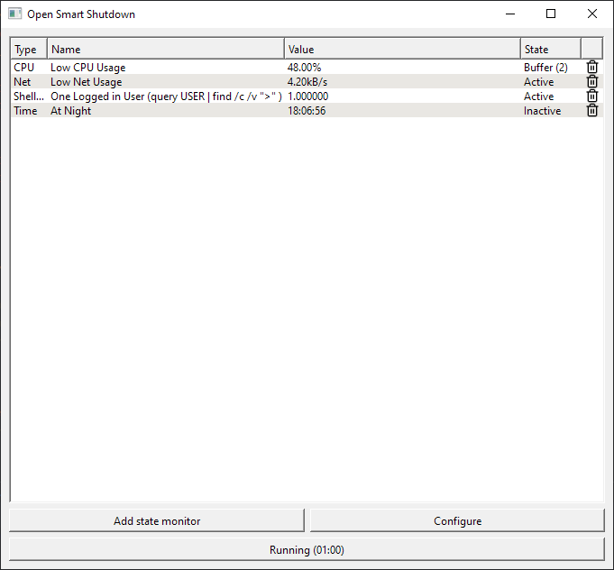

# Open Smart Shutdown
### See [current state](#current-state) before using.

A Qt based cross-platform open source tool to automate conditional shutdowns, similar to [AMP WinOFF](http://www.ampsoft.net/utilities/WinOFF.php).

This can help in various cases such as 
* Shutdown after downloading a game (based on low network and driveName usage)
* Shutdown after a render is finished (based on low CPU/GPU usage)
* Shutdown after an upload finishes (based on low network usage)

This program also aims to allow you to do anything you can do with a shell in it,
whether that be monitoring an event or performing a non-shutdown command.

This can be used in cases like
* Killing an RDP service after extended inactivity
* Send a notification to a phone when a process has ended
* Anything else you can do with a shell really. If you can monitor what you want in a shell 
and you can perform the finish task in a shell, you should be able to do it in Open Smart Shutdown.

## Goals of the Project
### Compatibility
The program's defaults should work on a fresh Windows 10 and Ubuntu install (macOS is not included as I don't have a system to test on).

The program should also be easily flexible to allow easy configuration to work on whatever Windows, Linux, or macOS system you can conjure.

### Flexibility
If you can do it in a shell, you can do it better in Open Smart Shutdown.
You should also be able to monitor as many events with each monitor being
highly configurable (e.g., buffers to prevent false negatives, polling rates, customizable ranges of positive values)

### Ease of Use
The program should let you use its flexibility to the fullest without fighting you.
This is a tool that should work for you so you shouldn't have to work for the tool.

You should also be able to load profiles you previously made to easily repeat previous Open Smart Shutdown tasks.

# Current state
The project, while not overly ambitious in my opinion, is too large of a time commitment to continue working on.
The project is usable with several major drawbacks. If anyone wants to use this and is affected by any of these
issues, create an issue and I may deal with them.

**Issues**
- Using shell state monitors spawns a new shell every time on Windows and closes it once done (so most commands result in quick flashing console window).
Shell things can be changed to use ProcessCreate to fix this

**Major Unimplemented Aspects**
- No cross-platform support
  - Currently only supports Windows. Only code in `system_monitor` and `events` has Windows specific code
  and it is wrapped in a platform macro. To get cross-platform support, either reimplement just those functions on another platform,
  or remove it and remove those bits from `state_monitor_creator_widget.cpp/h` and just use shell commands.
- No CLI/TUI
  - This was too ambitious. That said, the code in `core` is GUI independent, though Qt is used for signals (and notifications).
  CLI/TUI support can be added using `QCoreApplication` (no GUI required), or by replacing how signals are sent.
  Only `StateMonitorManager` sends signals on the non-GUI side of things.

**(Relatively) Minor Unimplemented Aspects**
- No import/export
- Cannot edit state monitor once it's created (but they can be deleted and re-added)
